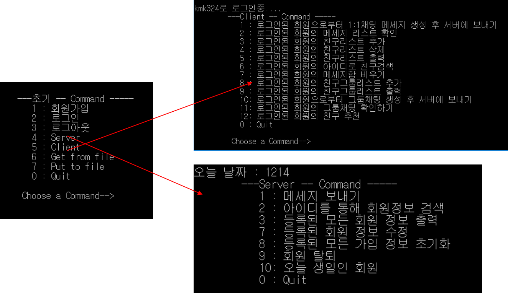

# Console-kakaotalk-system

C++ console KakaoTalk system 


1. **About**

   It is C++ console KakaoTalk system. If you want to know more details, please read doc files in './doc' folder.

2. **File description**

   | file    | description                                      |
   | ------- | ------------------------------------------------ |
   | ./doc/* | report and presentation ppt files in this folder |
   | ./exe/* | executing files in this folder                   |
   | ./src/* | all source files in this folder                  |

3. **How to run**

   ```
   cd ~/exe/
   ./console-kakaotalk-system.exe
   ```

4. **Execution screen**

   